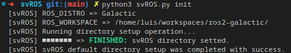
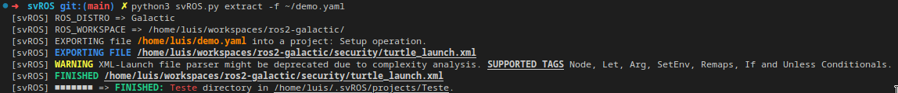
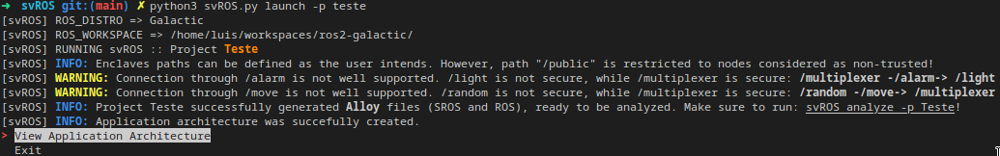
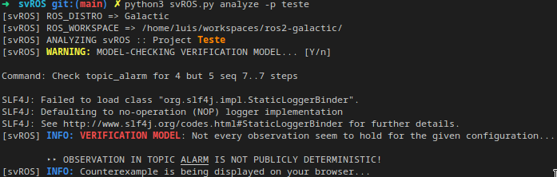

## A QUICK REFERENCE

Every functionality operates over the concept of a *Project*, that corresponds to a certain ROS2 architecture. Each project is stored within the same directory *Projects*, within the tool's main directory *HOME/.svROS*.

---
### Initialization

The proper installation of *HOME/.svROS*, and starting of its main directory, is achieved by running the following command. 
```
svROS init
```
<p align="center">
   
</p>
This functionality helps to easily set up a working environment for this specific purpose. After this operation, the reader can now proceed for the architecture extraction of a ROS application, and later, translate the inferred architecture to perform formal analysis.

---
### Extracting

Extracting of data through several nested parsers is made possible by this functionality, which deduces the topology of a ROS application by interpreting and converting ROS launch files and their associated nodes. To run this, a file must be passed as an input.
```
svROS extract -f $file
```
<p align="center">
   
</p>
Every file path inputted must respect the following syntax: A project name must be instantiated along with paths to launch files, that will be interpreted and respectively parsed.

```
project: PROJECT NAME
launch:
  - '/PATH/TO/LAUNCH FILE'
```

After executing the latest command, a project directory will be rightfully created within the *HOME/.svROS* projects directory. Two different templates are created inside the project's directory, which are then used to as the main data source for creating verification models in Alloy: one represents the network architecture through a *YML*-based file, whereas the other corresponds to a SROS2 policy file, in which privileges and communications are set upon nodes.

#### NOTEWORTHY MENTION
Most of the extracting procedures were implemented by using functionalities from [HAROS](https://github.com/git-afsantos/haros).

---
### Launching

Launching enables the analysis using Alloy. This functionality is responsible for taking those templates and translate the inferred data into Alloy verification models. It relies on multiple file parsers and Alloy meta-models, which are refined by each concrete application model. This functionality frees the user from creating its own model specification, easing the verification of **Observable Determinism**.

In order to run this, a project name *proj* must be given as a command argument.
```
svROS launch -p $proj
```
<p align="center">
   
</p>
The created models will be stored inside the project *proj* directory, in a sub-folder *models*.

---
#### DSL for svROS
A specification language that fits software development in ROS must prioritize communication and message-passing. Nodes act upon messages, whose data is very relevant to influence a node's behaviour. Thus, a specification language for ROS must rely on the relations between messages and, considering how messages work, it must also feature the following:

* References to communication entities.
* References to messages and their data.
* Relations between publish-subscribe calls.

svROS specification language is a user-orientated and context-specific DSL because it references concepts that are naturally familiar to ROS developers. It offers a simple and easily understandable specification core based on publish-subscribe patterns. Specifications are restricted by the language's syntax, enclosing patterns that improve its usability. The next figure shows the syntax whose semantics operate at the level of message passing, treating each corresponding node as a black-box.

<p align="center">
   
</p>

---
### Analyzing

Lastly, analyzing instructs the tool to perform model-checking in the project's verification model. This mechanism was decoupled from launching to allow a developer to modify the model freely and, most importantly, to comprehend how the translation was made. In order to run this, a project name *proj* must also be given.
```
svROS analyze -p $proj
```
<p align="center">
   
</p>

Upon running the latest command, the Alloy Analyzer captures possible counter-examples on the verification of Observational Determinism. These are temporally stored, to then be consequently parsed and displayed by the [Visualizer](https://github.com/luis1ribeiro/svROS/tree/main/svROS/visualizer).