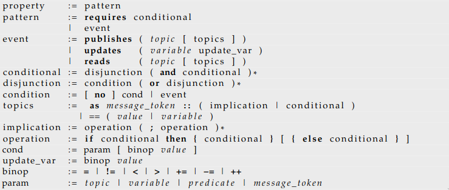
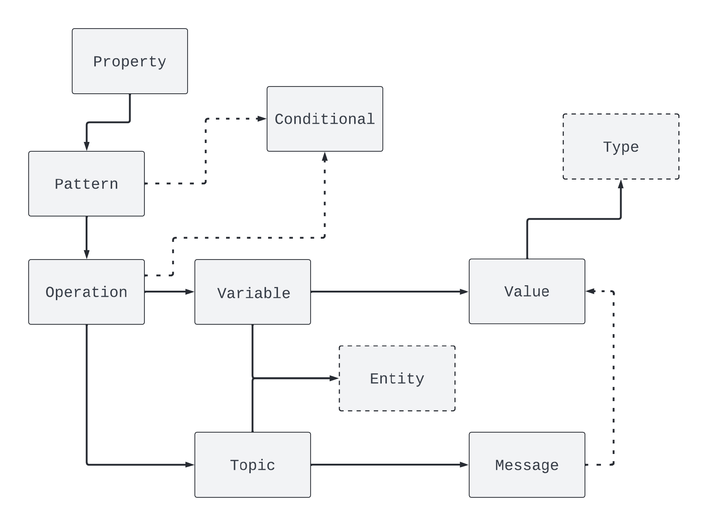

## DSL for svROS

A specification language that fits software development in ROS must prioritize communication and message-passing. Nodes act upon messages, whose data is very relevant to influence a node's behaviour. Thus, a specification language for ROS must rely on the relations between messages and, considering how messages work, it must also feature the following:

* References to communication entities.
* References to messages and their data.
* Relations between publish-subscribe calls.

svROS specification language is a user-orientated and context-specific DSL because it references concepts that are naturally familiar to ROS developers. It offers a simple and easily understandable specification core based on publish-subscribe patterns. Specifications are restricted by the language's syntax, enclosing patterns that improve its usability. The next figure shows the syntax whose semantics operate at the level of message passing, treating each corresponding node as a black-box.

   

A property is conceptually divided following the hierarchical structure depicted in the next figure. The tool is then capable of creating a direct translation between the language and Alloy using the respective parser and some intermediate data structures. Each node is specified by a sequence of properties, and the tool automatically creates an Alloy predicate encoding its behaviour following the above informal semantics. 

   

